# Hannah.shin TIL

## 날짜: 2025-02-04

## 스크럼
- 어제 한 일 : 설 연휴 공부 내용 정리, TIL 레포지토리 생성
- 학습 목표 1 : 실습 프로그램 설치 및 세팅
- 학습 목표 2 : 오늘 실습 내용 18시 안에 완료하기

## 패킷 트레이서를 활용한 topology 이해 및 네트워크 구축
### [실습 1] LAN Topology 구성
- 버스(Bus) 형

    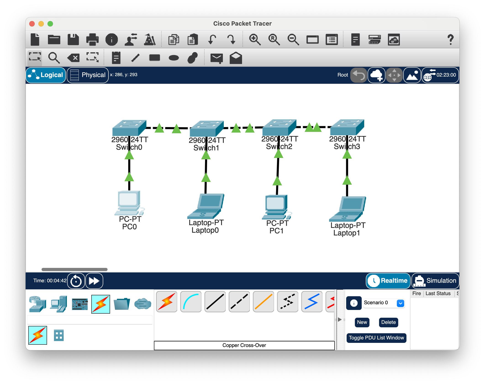

- 링(Ring) 형

    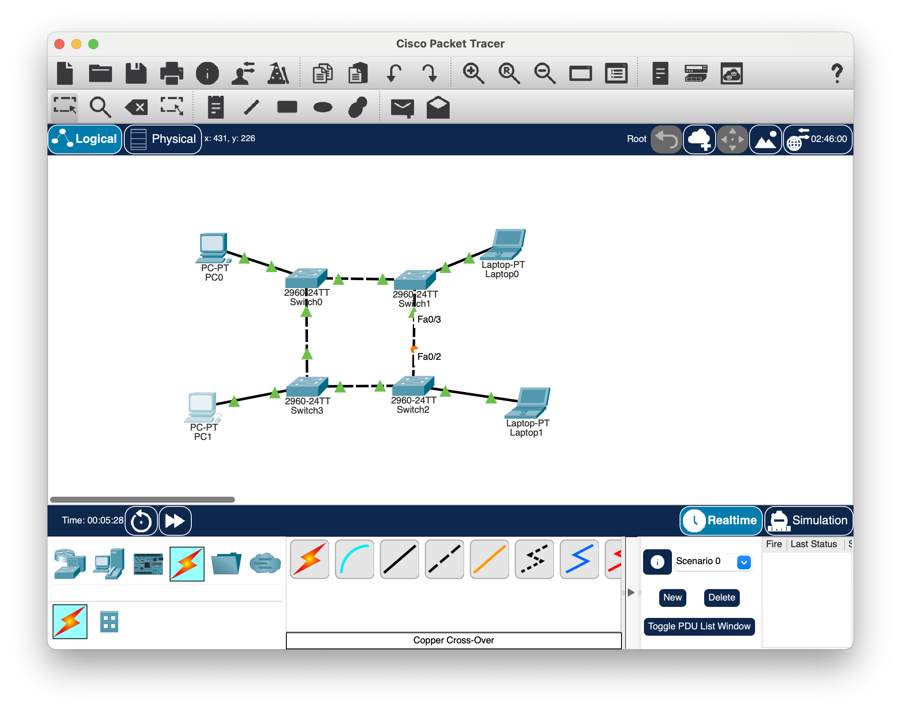

- 성(Star) 형

    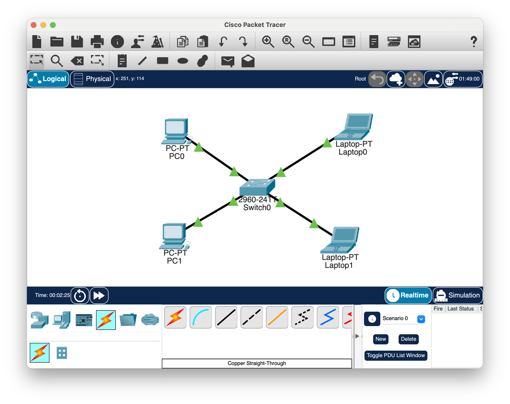

- 그물(Mesh) 형

    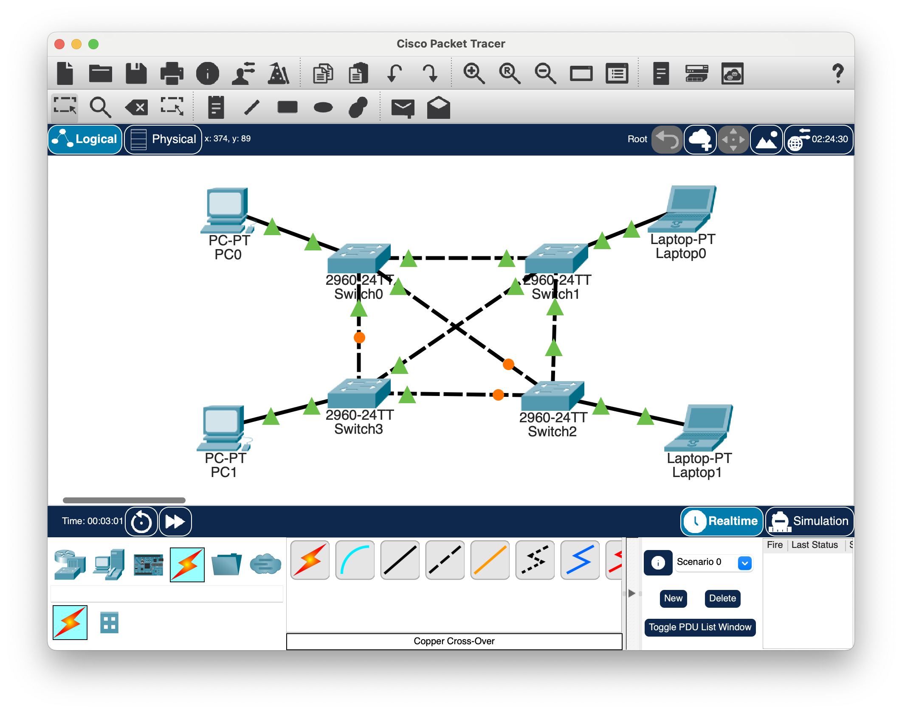

- 트리(Tree) 형

    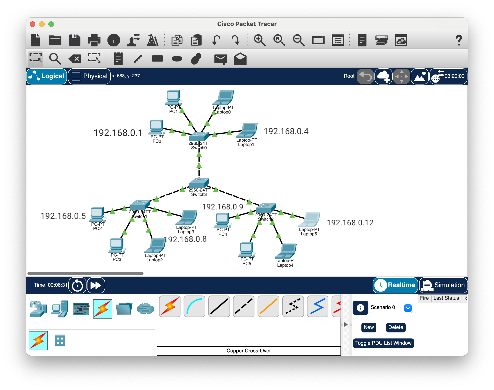
### [실습 2] VLAN
<aside>

**Virtual LAN (VLAN)**

물리적인 망 구성과는 상관없이 가상적으로 구성된 근거리 통신망(LAN). LAN 스위치나 비동기 전송 방식(ATM) 스위치를 사용해서 물리적인 배선에 구애받지 않고 방송 패킷(broadcast packet)이 전달되는 범위를 임의로 나누어 서로 다른 네트워크에 접속되어 있더라도 가상랜(VLAN)에 속한 단말들은 같은 LAN에 연결된 것과 동일한 서비스를 제공받을 수 있도록 한다. (출처: 정보통신용어사전)

</aside>

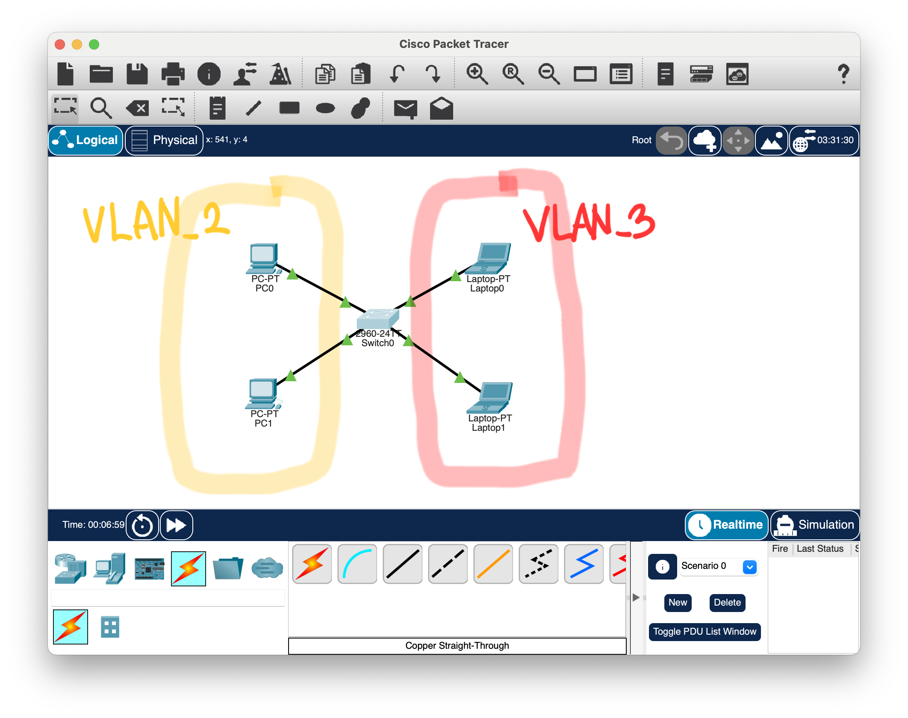

1. VLAN 생성

    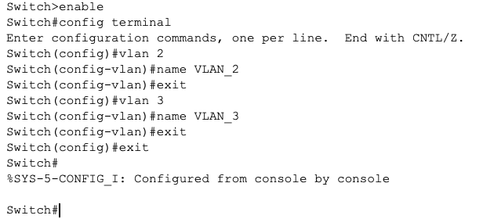

2. Switch0 포트에 VLAN 지정
    
    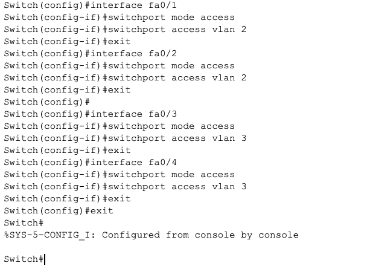
    
    `switchport mode access`: 해당 포트를 VLAN 전용으로 사용함을 선언

    `switchport access vlan {num}`: 해당 포트가 속한 VLAN 번호 설정
    
3. 통신 확인
    
    동일한 VLAN(`PC0->PC1`) 간 통신 가능, 다른 VLAN(`PC0->Laptop0`) 간 통신 불가능

    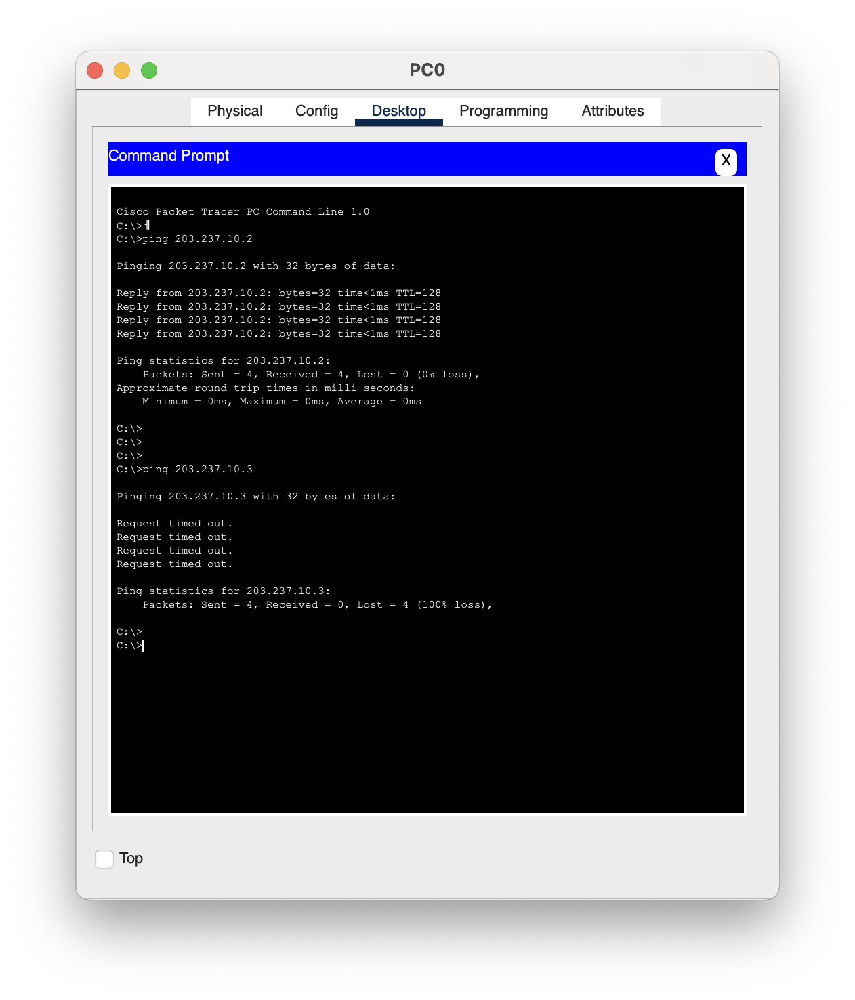

### [실습 3] 트렁크

<aside>

**트렁크**

스위치 간 프레임 전달에 하나의 물리적 연결(포트)을 공유, VLAN 트렁킹 된 스위치들 간에 여러 VLAN에서 나온 프레임들을 이 트렁크를 통해 전달함. (출처: 정보통신기술용어해설)

즉, 스위치와 스위치 간 프레임 전달 시 하나의 포트에 다수의 VLAN이 지나갈 수 있도록하는 링크.

</aside>

1. Switch1 VLAN 설정
    
    네트워크(PC2 - Switch1 - Laptop1)를 확장하여 Switch0과 Switch1을 연결.

    PC2는 VLAN2, Laptop2는 VLAN3에 위치하도록 설정.
    
    
2. 통신 확인

    PC0→PC2, Laptop0→Laptop2 각각 동일한 VLAN 내에 위치하지만 통신 불가

    ⇒ 통신을 가능하게 하려면 스위치0↔스위치1 간 VLAN 전용 포트를 설정해야함

3. 새로운 포트 추가 연결

    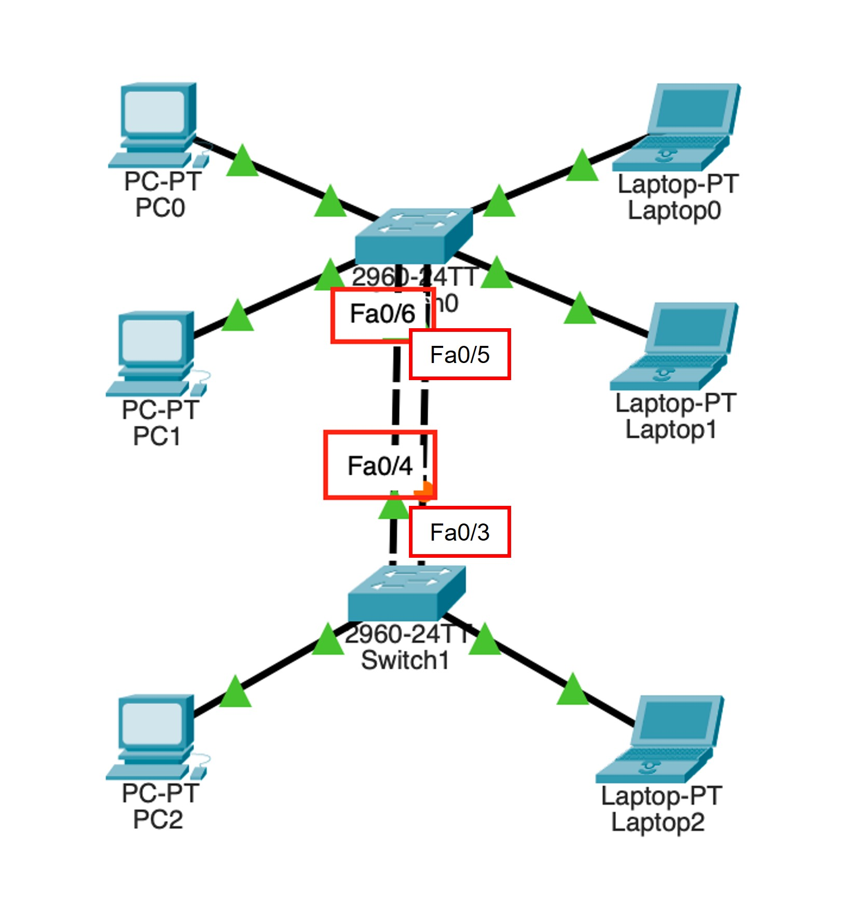

    - switch0의 fa0/5, fa0/6을 각각 VLAN 2,3 전용으로 설정

    - switch1의 fa0/3, fa0/4를 각각 VLAN 2,3 전용으로 설정

    => Laptop0 -> Laptop1 간에 정상적으로 통신은 가능하지만, 이러한 방식은 VLAN을 추가할 때마다 전부 통신 라인을 추가해주어야 함. 그렇기 때문에 **트렁크**를 사용. 트렁크는 모든 VLAN 패킷이 통과하는 링크.

4. 트렁크 설정

    

    switch0 fa0/5 ↔ switch1 fa0/3 하나의 회선만 연결

    switch0 fa0/5, switch1 fa0/3를 trunk 모드로 설정

    => 동일 VLAN(2->2) 간 통신은 가능하지만, 다른 VLAN(2->3) 간 통신은 불가능하다.

### [실습 4] inter-VLAN
<aside>

**inter-VLAN**

서로 다른 VLAN 간의 통신이 가능하도록 하는 방법. VLAN 간 통신을 하려면 라우터(게이트웨이)가 있어야 한다. 라우터를 경유하여 마치 다른 LAN으로 통신하는 것처럼 동작한다.

</aside>

1. 라우터 추가
    
    
    
2. 서브 인터페이스 설정
    
    Router0 fa0/0은 VLAN_2를 위한 주소와 VLAN_3를 위한 주소가 필요하지만, 하나의 인터페이스에 2개의 IP주소를 할당할 수 없음. ⇒ 서브 인터페이스로 해결
    
    **서브 인터페이스**: 하나의 인터페이스에 여러 VLAN들의 인터페이스를 논리적으로 나눈 것.
    
    1. fa0/0 활성화
                
    2. fa0/0에 2개의 서브인터페이스 생성
        - `fa0/0.2` 생성, VLAN2 연결, IP주소 할당

            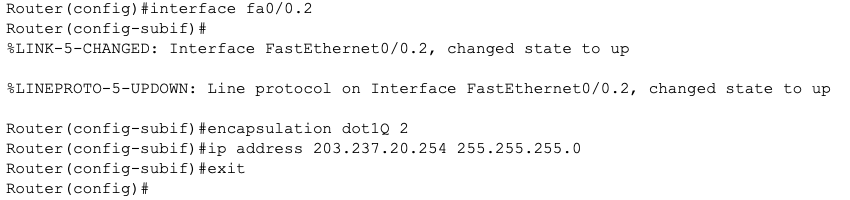

        - `fa0/0.3` 생성, VLAN3 연결, IP주소 할당

            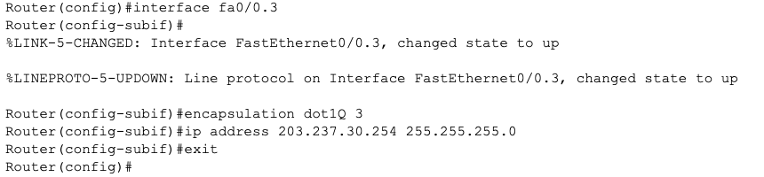
                        
3. switch1 fa0/4를 트렁크 모드로 설정

4. 게이트웨이 설정
    1. VLAN 2 (PC0, 1, 2) → 203.237.20.254
        
        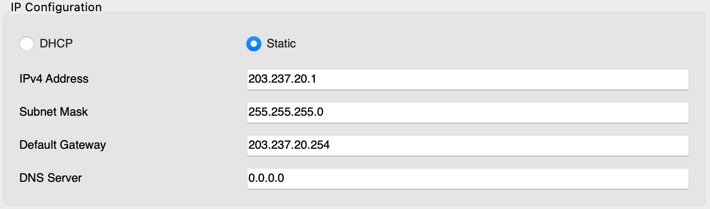
        
    2. VLAN 3 (Laptop0, 1, 2) → 203.237.30.254
        
        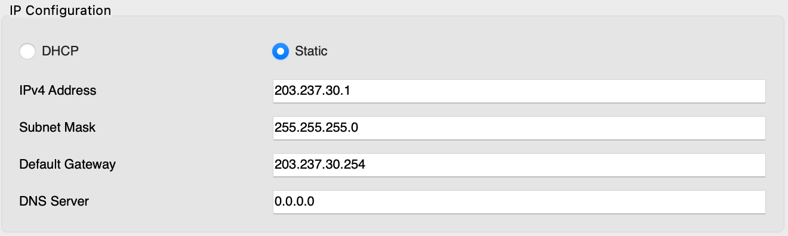
    
    => VLAN2 <-> VLAN3 정상적으로 통신 가능.

### 오늘의 회고

패킷 트레이서에서 `ping` 명령을 simulation 모드로 실행했을 때 스위치가 어떻게 동작하는지, inter-VLAN에서 라우터는 어떤 역할을 하는지 눈으로 확인할 수 있었다. 

네트워크관리사 실기를 준비할 때 라우터 설정을 한 적은 있지만 사실상 제대로 된 이해 없이 암기만 했던 터라 이번 실습은 이것과 관련하여 더 자세히 알 수 있는 기회였다.

실습, 복습을 하며 용어의 뜻을 찾아보고 적었는데, 생각해보니 이렇게 용어의 정의를 찾아본 적은 지금까지 거의 없었다. 어떤 것을 배울 때 정의를 먼저 확실히 알고 공부하는 것이 중요한 것 같다.

### 참고 자료 및 링크
- [(노션) [02/04(화)] 패킷 트레이서 실습 🏃‍♀️](https://www.notion.so/adapterz/02-04-bdcb3dd2ba8344708c94f3902332f7a5?pvs=4)

    - 본 문서에 넣지 못한 사진, 영상들을 포함한 노션 페이지 📑