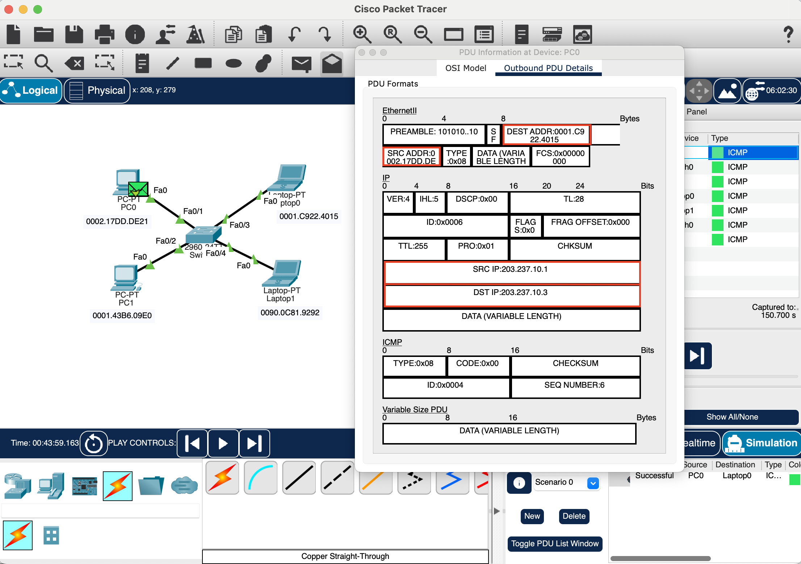
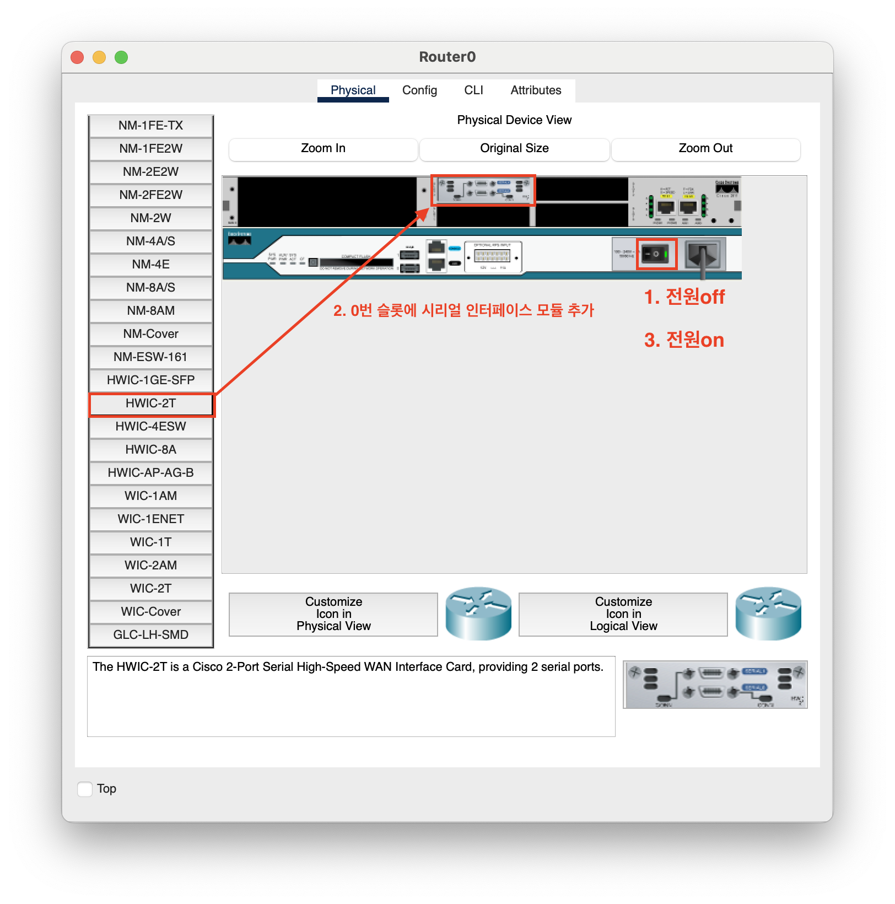
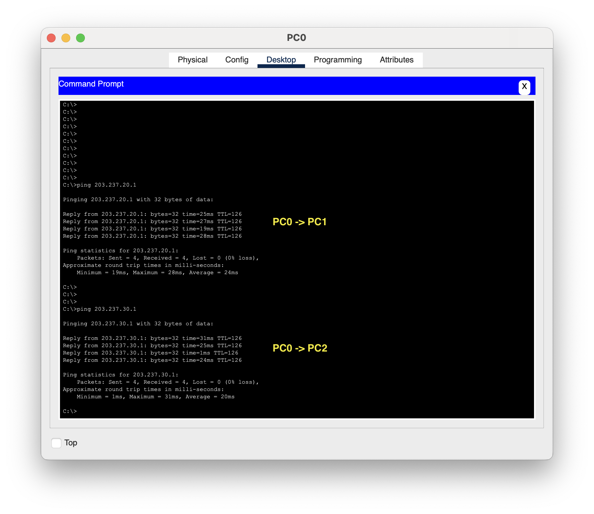

# Hannah.shin TIL

## 날짜: 2025-02-04

## 스크럼
- 어제 한 일 : 실습 완료, 저녁 식사 후 TIL 작성
- 학습 목표 1 : 오늘 실습 내용 17시 안에 완료하기

 

## 패킷 트레이서 실습 - 스위치, 라우터
### [실습 1] 시뮬레이션 이벤트

PC0 → Laptop0 `ICMP-request` 패킷

- SRC ADDR, SRC IP: 출발지(PC0)의 MAC주소와 IP주소
- DEST ADDR, DEST IP: 목적지(Laptop0)의 MAC주소와 IP주소

 

### [실습 2] 네트워크 구축
#### 라우터 - 시리얼 인터페이스 장착

PC와 달리 두 라우터 간에 데이터를 주고받기 위한 동기화가 필요함. FastEthernet이 아닌 Serial 인터페이스를 사용하므로 모듈을 추가해야함. 

#### 노드 연결

- **Console**
    
    : 통신용 단말이 아니라, Router0을 설정하기 위한 콘솔로 사용할 예정이므로 FastEthernet 케이블이 아닌 RS232케이블로 직접 라우터에 연결

- **Serial DCE (Data Communication Equipment)**

    : 시간 동기화를 주도하는 노드

- **Serial DTE (Data Terminal Equipment)**

    : 그에 따라 동기화하는 노드

    
    <ul>
        <li><strong>Console</strong>: 통신용 단말이 아니라, Router0을 설정하기 위한 콘솔로 사용할 예정이므로 FastEthernet 케이블이 아닌 RS232케이블로 직접 라우터에 연결</li>
        <li><strong>Serial DCE (Data Communication Equipment)</strong>: 시간 동기화를 주도하는 노드</li>
        <li><strong>Serial DTE (Data Terminal Equipment)</strong>: 그에 따라 동기화하는 노드</li>
    </ul>

#### IP 주소 설정

    
    <ul>
        <li><strong>컴퓨터</strong>: C클래스 대역(`203.237.x.x/24`) 사용</li>
        <li><strong>단말</strong>: `203.237.x.1`부터 시작</li>
        <li><strong>스위치, 서버</strong>: 원격 관리가 필요, `203.237.x.100`부터 시작</li>
        <li><strong>라우터</strong>: 광역의 랜들을 연결할 것이므로 A클래스 사용.</li>
    </ul>

#### 총 6개의 LAN으로 구성된 네트워크

    

Laptop0을 라우터의 콘솔로 사용 → Laptop0의 터미널에서 Router0 설정 가능

- Router0 - Switch0 연결
    
    

    
- Router0 - Router1 연결
    
    

    
- 동일한 방법으로 Router0 - Router2도 연결 (`2.2.2.1/255.255.255.252`)

 

**스위치**

> 스위치는 2계층 장비로, IP주소가 아닌 MAC주소를 사용하지만, 원격 접속으로 스위치를 관리하기 위해 IP 주소를 할당한다. 단, 인터페이스마다 할당하지 않고 VLAN1에 할당한다.

- Switch0의 IP 주소 설정 및 인터페이스(fa0/1, fa0/2, fa0/3 활성화)

    

 

- 동일 LAN에 속한 노드 간 연결 확인

    

 

- PC0 → PC2 통신 불가

    

    라우터0이 목적지 IP주소를 보고 어느 인터페이스로 라우팅 할 지 결정할 수 없기 때문.

    ⇒ **라우팅 테이블** 필요

 

#### 라우팅 (Routing)

> 네트워크 상에서 IP주소 등을 이용하여 출발지에서 목적지까지 패킷을 체계적으로 전달하기 위하여 전달 경로를 선택하는 과정

- 정적 라우팅

    : 관리자가 수동으로 경로를 미리 설정하는 방법으로, 네트워크 상태가 변할 경우 관리자가 갱신함. 간단하고 소규모 네트워크에서 사용됨

- 동적 라우팅
    
    : 네트워크 상태에 따라 경로를 결정하는 방식. 복잡하지만 자동으로 최적의 경로를 탐색함.

- 라우팅 테이블

    : 어떤 라우팅 방식을 사용하든 라우터로 들어온 패킷을 전달하기 위해 이정표에 해당하는 라우팅 테이블을 관리함.   
   
     
**Router0의 라우팅 테이블 초기 상태**

총 [6개의 LAN](#총-6개의-lan으로-구성된-네트워크) 중 3개의 LAN에 대한 라우팅 정보가 없음

- 2번 네트워크(203.237.20.x/24)인 패킷 → Se0/3/0 또는 IP `1.1.1.2`
- 3번 네트워크(203.237.30.x/24)인 패킷 → Se0/3/1 또는 IP `2.2.2.2`
- 6번 네트워크(3.3.3.x/30)인 패킷 → Se0/3/1 또는 Se0/3/0

 

정적 라우팅 설정

라우팅 테이블에 3개의 네트워크 추가됨   
   
    

**Router1 정적 라우팅 설정**

초기 라우팅 테이블

    
    <ul>
        <li>목적지가 (203.237.10.x/24)인 패킷 → Se0/3/0</li>
        <li>목적지가 (203.237.30.x/24)인 패킷 → Se0/3/1</li>
        <li>목적지가 (2.2.2.x/30)인 패킷 → Se0/3/1</li>
    </ul>

 

   

    

**Router2 정적 라우팅 설정**

초기 라우팅 테이블

    
    <ul>
        <li>목적지가 (203.237.10.x/24)인 패킷 → Se0/3/0</li>
        <li>적지가 (203.237.20.x/24)인 패킷 → Se/0/3/1</li>
        <li>목적지가 (1.1.1.x/30)인 패킷 → Se0/3/1</li>
    </ul>

 

   

    

**IP 주소 설정 및 연결이 완료된 상태 (전부 초록색으로 바뀜)**

#### 통신 테스트

ping

    
    
    

시뮬레이션

- PC0 → PC1
    
        PC0 → Switch0 → Router0 → Router1 → PC1 → Router1 → Router0 → Switch0 → PC0

    

- Server0 → PC2
    
        Server0 →Switch0 → Router0 → Router2 → PC2 → Router2 → Router0 → Switch0 → Server0

    

     

    

        
            ICMP request 
            
        
        
            ICMP response 
            
        
    

### 오늘의 회고

- 어제 시뮬레이션으로 돌리기만 했는데 오늘은 패킷도 확인할 수 있다는 것을 알아서 패킷을 확인해보았다.
- 라우팅 테이블이 어떤 식으로 만들어지고 라우터는 어떻게 경로를 찾아 데이터를 보내는지 직접 보며 확인할 수 있는 실습이었다.
- TIL 작성하며 조금 더 예쁘게 정리하려고 하다보니 HTML 공부도 덤으로 하는 느낌이다. 

### 참고 자료 및 링크
- [(노션) [02/04(화)] 패킷 트레이서 실습 🏃‍♀️](https://www.notion.so/adapterz/02-05-e17c7b0ec1bd4741b55519fa47063114?pvs=4)

    - 본 문서에 넣지 못한 영상을 포함한 노션 페이지 📑