# Hannah.shin TIL

## 날짜: 2025-02-04

## 스크럼
- 어제 한 일 : 실습 완료, 저녁 식사 후 TIL 작성
- 오늘 한 일 1 : 네트워크 보안 내용 정리

    - 🔗 [[심화 강의] 네트워크 보안](#심화-강의-네트워크-보안)

- 오늘 한 일 2 : 패킷 트레이서 방화벽 실습

    - 🔗  [[패킷 트레이서] 방화벽](#패킷-트레이서-방화벽)

<br>


## [심화 강의] 네트워크 보안

<aside>

**정보 보안**

다양한 위협으로부터 보안을 보호하는 것. 넓은 의미에서의 보안은 **“우리가 생산하거나 유지해야 할 정보에 위험이 발생하거나 사고가 날 염려없이 편안하고 온전한 상태를 유지하는 일련의 활동”**

</aside>

### 보안의 3대 필수 요소

1. **기밀성(Confidentiality)**
    
    인가되지 않은 사용자가 정보를 보지 못하게 하는 모든 작업 (암호화)
    
2. **무결성(Integrity)**
    
    정확하고 완전한 정보 유지에 필요한 모든 작업 (데이터 변조 방지)
    
3. **가용성(Availability)**
    
    정보가 필요할 때 접근을 허락하는 일련의 작업 (서비스 24/7 가동)
    
    <br>

### 네트워크의 정보 보안

수집된 정보를 침해하는 행동을 기술적으로 방어하거나 정보의 송수신 과정에 생기는 사고를 막기 위한 작업. 

- **1차 목표**

    : 정보를 가진 시스템을 공격해 유출하거나 사용하지 못하게 하거나 시스템이 동작하지 못하게 해 정보 서비스를 정상적으로 구동할 수 없게 만드는 행위를 네트워크에서 적절히막는 것

- **2차 목표**

    : 여러 가지 서비스를 제공하기 위해 한 자리에만 있는 것이 아니라 네트워크를 통해 복제, 이동되므로 그 유출을 막는 것

End point에 대한 보안이 중요해짐에 따라 BOTTOM-UP 형식으로 네트워크 보안이 발전하고 있음
   
   <br>

### **주요 개념**

- 트러스트(Trust) 네트워크: 외부로부터 보호받아야 할 네트워크

- 언트러스트(Untrust) 네트워크: 신뢰할 수 없는 외부 네트워크(인터넷 구간)

- DMZ (DeMilitarized Zone) 네트워크: 우리가 운영하는 내부 네트워크이지만 신뢰할 수 없는 외부 사용자에게 개방해야하는 서비스 네트워크. 일반적으로 인터넷에 공개되는 서비스를 DMZ 네트워크에 배치함.

- **트래픽의 방향과 용도**에 따른 분류
    
    
    | 인터넷 시큐어 게이트웨이(Internet Secure Gateway) | 데이터 센터 시큐어 게이트웨이(Data Center Secure Gateway) |
    | --- | --- |
    | 트러스트(or DMZ) → 언트러스트 통신 통제 | 언트러스트 → 트러스트(or DMZ) 통신 통제 |
    | - 방화벽, SWG, 웹 필터, 애플리케이션 컨트롤, 샌드박스와 같은 다양한 서비스나 네트워크 장비<br> - 내부 사용자가 인터넷으로 통신할 때 보안을 제공, 통제하기 위해 사용. | - 방화벽, IPS, DCSG, WAF 등의 장비<br> - 상대적으로 고성능(IDC 급)이 필요.<br> - 외부의 직접적인 공격을 막아야 하므로 인터넷 관련 정보보다 공격 관련 정보가 더 중요 |

- **네트워크 보안 정책 수립**에 따른 분류
    
    
    | 화이트리스트 (White List) | 블랙리스트 (Black List) |
    | --- | --- |
    | 전체적으로 block을 해두고, 방어에 문제가 없다고 명확히 판단되는 통신만 allow | 전체적으로 allow를 해두고, 공격이라고 판단되는 통신을 block |
    | - 일반적으로 IP와 통신 정보에 대해 명확히 아는 경우<br> - 회사 내부에서 사용하는 방화벽이 명확한 정책에 의해 필요한 서비스만 허용<br> - 통신 정보를 상세히 알아야 하고 세부적인 통제가 필요하므로 많은 관리 인력이 필요할 수 있음 | - 각종 패턴으로 공격을 방어하는 장비(IPS, 안티바이러스, WAF)들은 일반적으로 블랙리스트 기반<br> - 공격 기법을 판단해 탐지하도록 DB를 만듦. 이런 DB를 공격패턴(시그니처)이라고 함<br> - 공격DB를 최신으로 유지하는 것이 바람직함 |
    
    대부분의 장비는 수립 정책에 따라 화이트리스트 기법과 블랙리스트 기법 모두 사용할 수 있음. 최근 보안 벤더들은 두 기법을 적절히 섞어 사용할 것을 권고하고 있음
    
- 탐지 에러 타입 - **정탐, 오탐, 미탐**
        
    |  | 공격 상황 | 정상 상황 |
    | --- | --- | --- |
    | **공격 인지** | True Positive (정상 탐지) | False Positive (오 탐지) |
    | **정상 인지** | True Negative (미 탐지) | False Negative (정상 탐지) |
      
   <br>

### 보안 솔루션

데이터 센터에 보안 장비를 디자인할 때 `DDoS - 방화벽 - IPS - WAF` 형태와 같이 여러 단계로 공격을 막도록 인라인 상에 여러 장비를 배치.

- DDoS 방어 장비(프로파일링): 프로토콜 취약점
- 방화벽(포트 제어): FTP, RDP, Telnet
- IPS(시그니처): 프로토콜 abnomaly, 취약점 공격, WORM, 스캐닝
- WAF(시그니처): Application DoS, SQL인젝션, 웹취약점, 웹쉘
   
   <br>

### DDoS 방어 장비 동작 방식

**공격 타입**

- 볼류메트릭: 대용량 트래픽을 사용해 공격 대상의 대역폭을 포화시킴
- 프로토콜:  L3, 4 프로토콜 스택의 취약점을 악용. 공격 대상의 리소스를 모두 사용해 서비스 중단 유발
- 애플리케이션: L7 프로토콜 스택(애플리케이션)의 취약점을 악용. 서버 자원을 소모시킴

**방어 방식**

1. 평소 데이터와 비교
    1. 평소 데이터 흐름을 습득해 일반적인 대역폭, 세션량, 초기 접속량 등을 저장

    2. 습득한 데이터와 일치하지 않는 과도한 트래픽이 들어오면 알려주고 차단

2. 보안 데이터베이스 기반 방어

    1. IP 평판 데이터베이스를 공유해 DDoS 공격으로 사용된 IP 기반으로 방어여부를 결정하거나 특정 공격 패턴을 방어

**DDoS 방어 서비스**

- 클라우드 서비스, 회선 사업자의 방어 서비스, DDoS 방어 장비를 사내에 설치

- DDoS 공격을 탐지해 공격을 수행하는 IP 리스트를 넘겨주면 방어 장비나 ISP 내부에서 이 IP를 버리는 것이 가장 흔한 DDoS 방어 기법

**DDoS 방어 장비**

- IDC 네트워크 내부와 외부의 경계에서 볼류메트릭 공격을 우선 막음

- 다양한 공격 정보를 수집한 데이터베이스를 활용하기도 함
   
   <br>

### 방화벽 (Firewall)

> L3, 4 정보를 기반으로 정책을 세울 수 있고, 해당 정책과 매치되는 패킷이 방화벽을 통과하면 그 패킷을 허용하거나 거부할 수 있음

**초기 방화벽**

*Stateless* 또는 *패킷 필터* 방화벽

패킷의 5-튜플(SrcIP, DstIP, Protocol No, Src Port, Dst Port)를 확인해 해당 패킷이 방화벽에 설정된 정책에 일치되는 것이 있는지 확인하고 허용(또는 차단). 

=> 불특정 다수 기반의 정책을 정의할 때는 룰셋(Ruleset)이 복잡해지고 보안이 약화되는 문제
   
   <br>

**현대적 방화벽 (SPI 엔진)**

상태 기반 방화벽 (Stateful Inspection Firewall) - 세션 테이블 참조

1. 장비에 패킷이 들어오면 우선 세션 상태 테이블 확인

2. 조건에 맞는 세션 정보가 테이블에 있을 때, 푸워딩 테이블 확인

3. 조건에 맞는 세션 정보가 테이블에 없을 때, 방화벽 정책 확인

4. 방화벽 정책은 맨 위의 정책부터 확인해 최종 정책까지 확인한 후 없을 때 암시적인 거부(Implicit Denial) 규칙을 참고해 차단

5. 허용 규칙이 있으면 내용을 세션 테이블에 작성

6. 포워딩 테이블 확인

7. 조건에 맞는 정보가 테이블에 있을 때, 적절한 인터페이스로 패킷을 포워딩

8. 조건에 맞는 정보가 테이블에 없을 때, 패킷을 폐기
   
   <br>
   
### IDS, IPS

> 방화벽은 3, 4계층 방어만 가능 → IDS와 IPS가 5, 6, 7계층에서 이루어지는 공격을 탐지, 방어.

- **IDS (Instrusion Detection System; 침입 탐지 시스템)**
    
    - 방어보다는 탐지에 초점을 둠
    
    - 패킷을 복제하여 검토하고 침입 여부를 판별
    
- **IPS (Instrusion Prevention System; 침입 방지 시스템)**
    
    - 공격이 발견되면 직접 차단하는 능력을 갖춘 장비. 
    
    - 일반적으로 IPS라고 부르는 시스템은 NIPS(Network based IPS). 클라우드의 경우 여러가지 제약사항 때문에 클라우드 내부 네트워크에서 NIPS 배포가 어려워 HIPS(Host based IPS) 사용 빈도가 늚
    
    - 기본적으로 IPS는 공격 데이터베이스(시그니처)를 사용한 패턴 매칭 방식으로 운영
    
    <br>

## [패킷 트레이서] 방화벽

### RNA

- Routing: 라우터에서 패킷을 전달하기 위한 경로 설정
- NAT: 사설 IP 주소를 가지고 외부에서 인식할 수 있는 공인 IP주소로 변경해서 통신할 수 있도록 해주는 기능
- ACL: 자원(내부망)에 대한 외부 트래픽의 접근 허용 여부를 제어하는 규칙

RNA를 올바르게 설정해야 ASA 기능이 동작함

### 망 구성

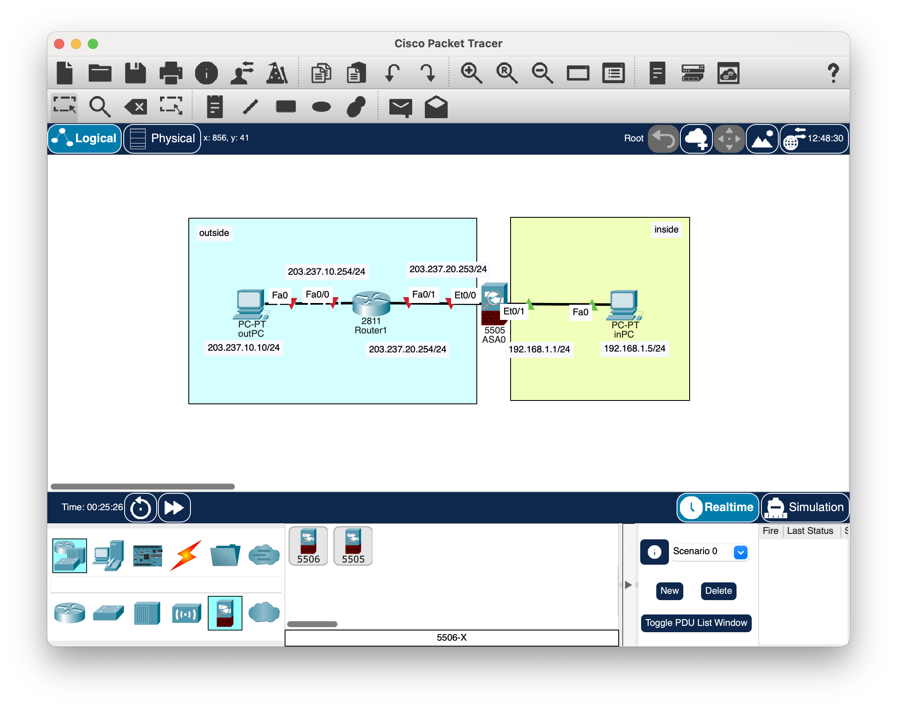

### ASA0

|  |  |
| --- | --- |
| **inside (내부망)** <br> 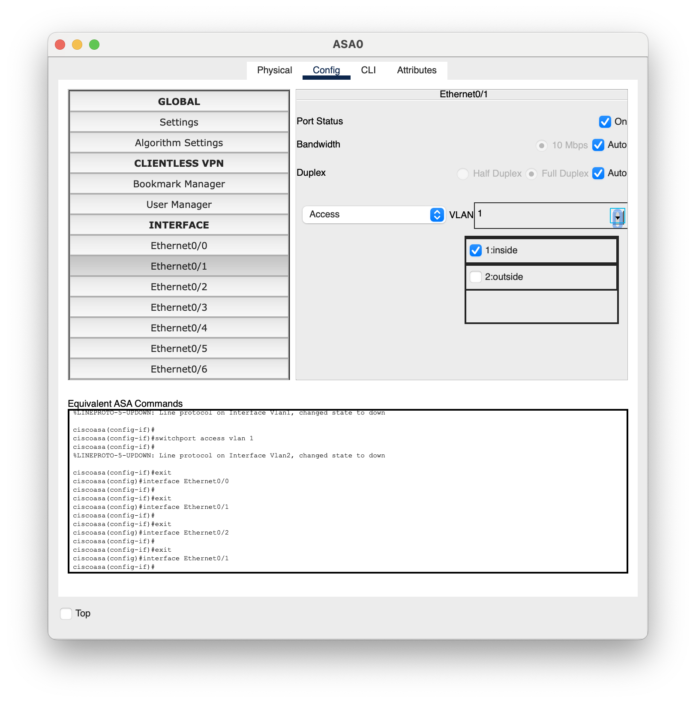 | **outside (외부망)** <br> 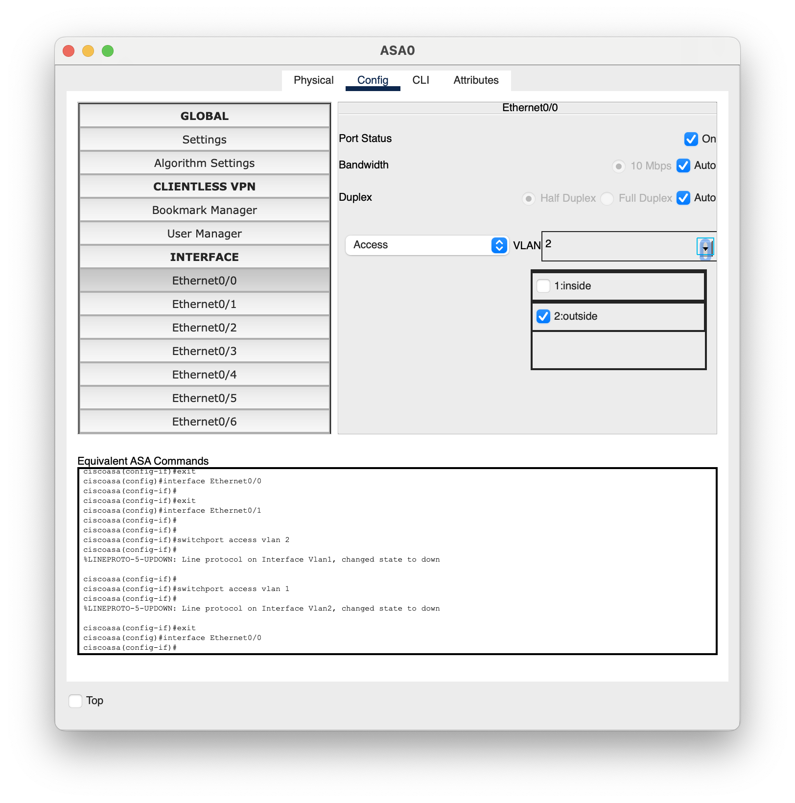 |


**VLAN, 인터페이스 통신 상태 확인**

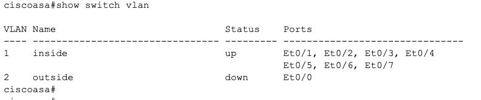

- outside IP 주소 설정 (inside는 설정되어 있음)

    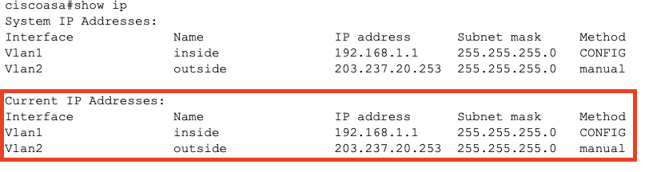

    |  |  |
    | - | - |
    | 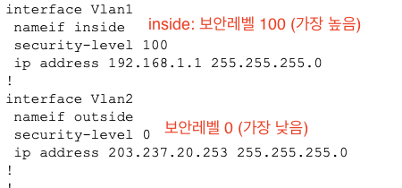 | 보안레벨이 **높은 곳에서 낮은 곳으로** 트래픽 흐름 허용 <br> - 내부(100) → 외부(0) : 가능 <br> - 외부(0) → 내부(100) : 불가능 |
    | 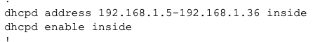 | 내부망 노드들은 DHCP를 이용해 IP 주소 할당 <br> - 범위: 192.168.1.5 ~ 192.168.1.36 |
    |  |  |

    <br>


| **inPC DHCP 설정** |  |
| - | - |
| 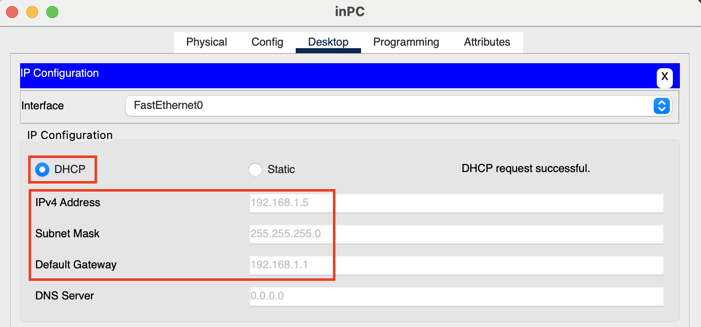 | inPC <br> - 내부망 PC는 ASA가 DHCP로 IP주소 할당 <br> - 게이트웨이는 `ASA0 inside`의 ip주소로 고정됨 |
   
   <br>

**Router 설정**

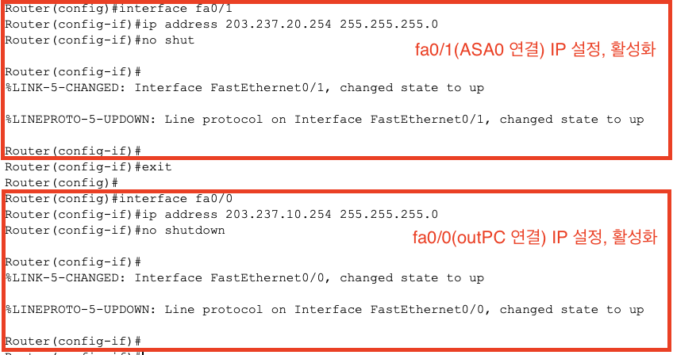

### RNA 설정

| **라우팅** |  |
| - | - |
| 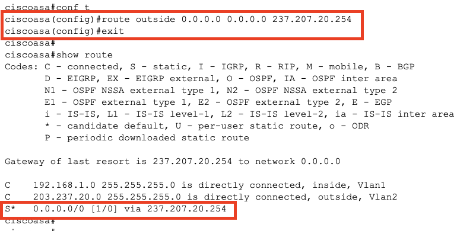 | *route <VLAN명> <외부망 네트워크 주소> <외부망 서브넷마스크> <상대 IP주소>* <br><br> `route outside 0.0.0.0 0.0.0.0 203.237.20.254` <br> 패킷의 **목적지 주소와 관계없이 외부망의 라우터**인 203.207.20.254로 전송 |
|  |  |

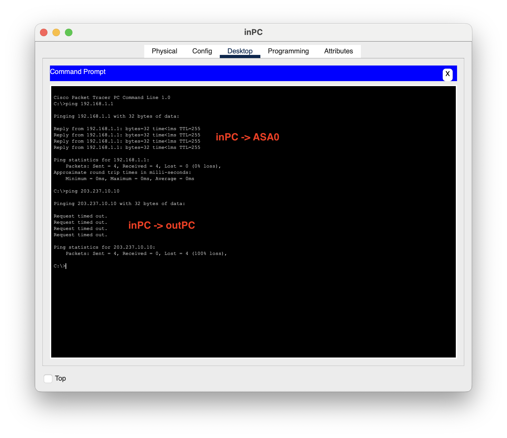


**NAT**

> `inPC → outPC` 전달 후 되돌아오는 과정에서 `Router → ASA0`으로 전달 불가

| outPC → Router1로 전달되는 패킷 |  |
| - | - |
| 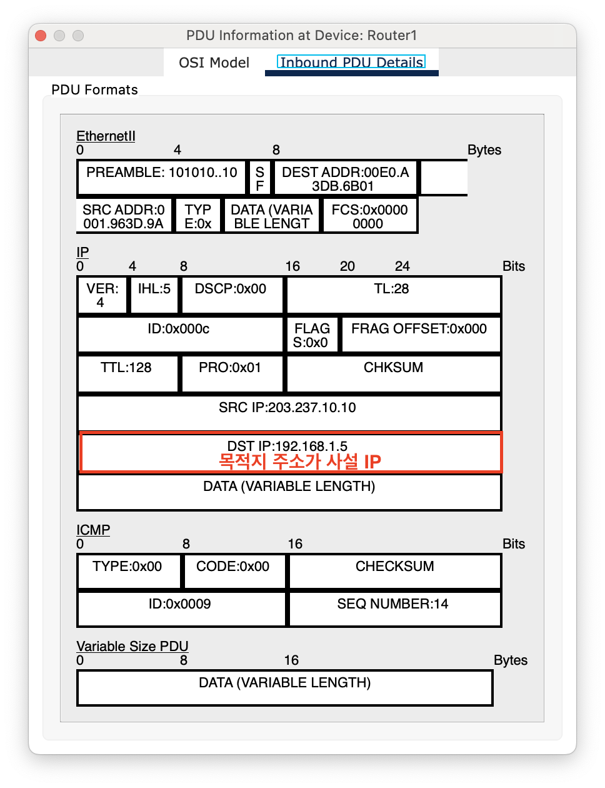 | 목적지 주소가 사설IP이기 때문에 외부에서 인식 불가 <br> → Router는 패킷을 어디로 보내야 할 지 알 수 없음 <br> ⇒ ASA가 사설IP를 공인IP로 변경해서 내보내야함 (NAT) <br><br> 사설IP 주소를 가지는 노드는 모두 ASA0 주소로 내보냄 <br> → ASA0는 NAT 테이블을 유지해서 응답 패킷을 누구에게 전달할지 파악해야함 |


- NAT 설정

    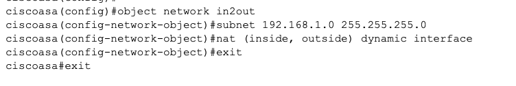

    1. in2out 객체 생성

    2. 대상 서브 네트워크 정의 (192.168.1.0 네트워크 주소를 가지는 내부 사설 IP 주소 대역)

    3. NAT 설정 (내외부망 연결하는 (inside, outside) 동적 매핑, 공인 IP주소는 인터페이스 주소)

**ACL**

| Router1 → ASA0 전달 패킷 |  |
| - | - |
| 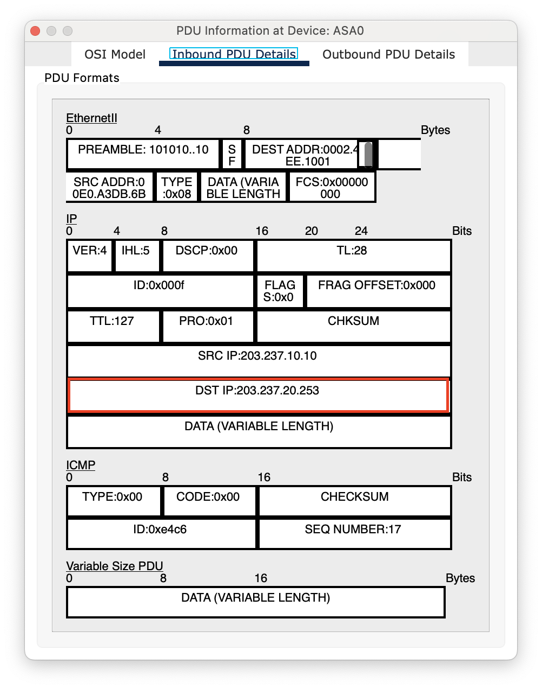 | 목적지 주소는 공인IP 주소로 제대로 설정되어 있으나 `외부망 → 내부망` 트래픽 흐름이 방화벽에서 차단되어 있어 전달 불가. <br><br> <strong>ACL</strong> <br>: 인터페이스마다 어떤 출발지와 목적지를 가지는 어떤 트래픽을 허용/거부 할지 정의하는 <strong>접근제어 목록</strong>
 |


- ACL 정의
    
    ```
    access-list <ACL명> <타입> <동작> <프로토콜> <출발지> <목적지>
    ```
    
    `access-list out2in extended permit icmp any any`
    
    → out2in 이름을 갖는 확장된 ACL 정책. 임의의 출발지에서 임의의 목적지로 가는 ICMP 패킷 허용
    
- ACL 적용
    
    ```
    access-group <ACL명> <트래픽> <인터페이스 키워드> <VLAN 명>
    ```
    
    `access-group out2in in interface outside`
    
    → out2in ACL을 outside 인터페이스(외부망)로 들어오는 트래픽에 대해 적용
    
    ⇒ 외부망에서 내부망으로 들어오는 모든 ICMP 패킷 허용
    
    <br>

- ASA0의 ACL 설정
    
    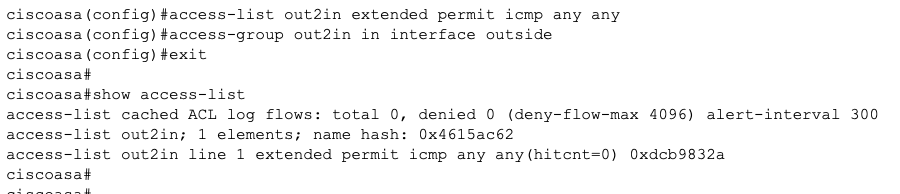

    <br>
    
- inPC → outPC ping
    
    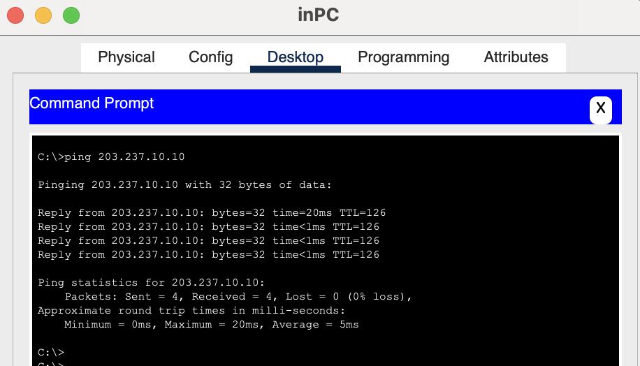
   
   <br>

### 오늘의 회고

- CISCO ASA를 단계적으로 설정하며 방화벽에서의 패킷 흐름을 알게 되었다.

- 처음 알게 된 것 1
    
    : 보안 레벨이 높은 곳에서 낮은 곳으로 트래픽이 흐른다.

- 처음 알게 된 것 2

    : 내부망에서 외부망으로 패킷을 내보낼 때 ASA가 사설IP인 출발지 주소를 공인IP로 바꾸어 내보낸다. 외부망에서 응답 패킷을 보낼 때 목적지 주소가 사설IP이면 라우터에서 경로를 찾지 못하기 때문이다. 실습에서는 사설IP를 가지는 노드 모두 인터페이스 주소로 내보냈기 때문에 ASA는 NAT테이블을 유지하여 응답 패킷을 누구에게 전달할 지 관리한다.

### 참고 자료 및 링크
- (노션) [[02/06(목)] 심화강의 - 네트워크 보안](https://www.notion.so/adapterz/d1c0bca1ddb04fa696ef823b042533a1?pvs=4)

- (노션) [[02/06(목)] 패킷 트레이서 실습](https://www.notion.so/adapterz/56e6d86d4a0847dcab1f142d4cfd2a7e?pvs=4)

